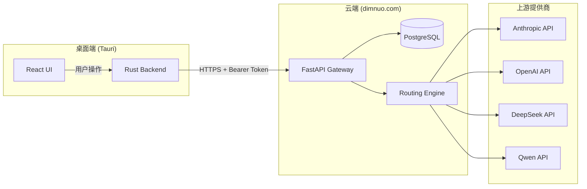
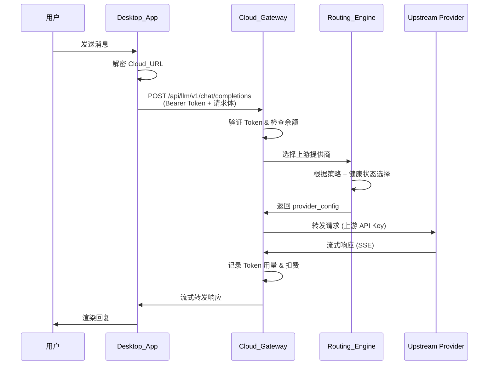
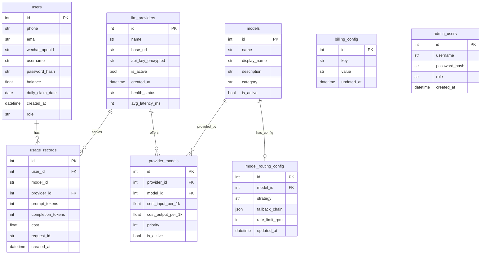
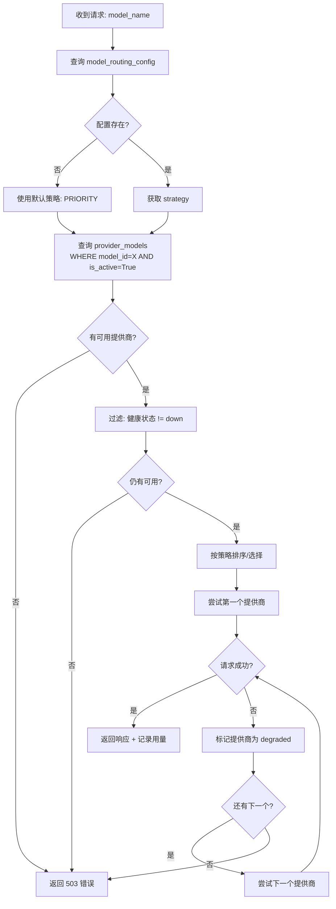

# 设计文档：Cloud-Locked LLM Gateway

## 概述

本设计将 9xBot 桌面应用从可自由配置 LLM 提供商的客户端转型为云端锁定平台。核心架构为三层结构：

- **桌面端 (Tauri)** — 前端 UI + Rust 后端，硬编码加密的云端地址
- **云端网关 (FastAPI)** — 部署在 dimnuo.com，负责认证、路由、计费
- **上游 LLM 提供商** — Anthropic、OpenAI、DeepSeek、Qwen 等

所有 LLM 请求必须经过云端网关代理，桌面端不再持有任何上游 API Key。

## 架构

### 系统架构图



### 聊天请求数据流



## 组件与接口

### 1. 桌面端组件

| 组件 | 职责 |
|------|------|
| `build.rs` (编译时加密) | 将 Cloud_URL 用 AES-256 加密嵌入二进制文件 |
| `cloud_url.rs` | 运行时解密 Cloud_URL 的模块 |
| `AuthGate` (React) | 强制登录门控组件，未登录时阻止所有功能 |
| `UsageDashboard` (React) | 余额 & 用量统计面板 |
| 移除: Settings 中 LLM API Key 配置 | 不再暴露本地提供商配置 |

### 2. 云端组件

| 组件 | 职责 |
|------|------|
| `app/gateway/` (FastAPI) | LLM 代理网关，OpenAI 兼容接口 |
| `app/routing/` | 多策略路由引擎 |
| `app/billing/` | Token 计费与余额管理 |
| `app/auth/` | 用户认证 (扩展现有 JWT) |
| `app/admin/` | 管理后台 API |
| `app/models/` | SQLAlchemy ORM 模型 |

### 3. 管理后台

| 组件 | 职责 |
|------|------|
| Vue 3 + Element Plus SPA | 管理面板前端 |
| 页面: Dashboard / Providers / Models / Routing / Users / Billing | 完整管理功能 |

## 数据模型

### 数据库: PostgreSQL + SQLAlchemy 2.0

#### 表结构

```python
# app/models/user.py
class User(Base):
    __tablename__ = "users"

    id: Mapped[int] = mapped_column(primary_key=True)
    phone: Mapped[str | None] = mapped_column(String(20), unique=True, nullable=True)
    email: Mapped[str | None] = mapped_column(String(255), unique=True, nullable=True)
    wechat_openid: Mapped[str | None] = mapped_column(String(128), unique=True, nullable=True)
    username: Mapped[str] = mapped_column(String(64), unique=True)
    password_hash: Mapped[str] = mapped_column(String(255))
    balance: Mapped[float] = mapped_column(Float, default=0.0)
    daily_claim_date: Mapped[date | None] = mapped_column(Date, nullable=True)
    created_at: Mapped[datetime] = mapped_column(DateTime, server_default=func.now())
    role: Mapped[str] = mapped_column(String(20), default="user")  # user / vip / banned
```

```python
# app/models/provider.py
class LlmProvider(Base):
    __tablename__ = "llm_providers"

    id: Mapped[int] = mapped_column(primary_key=True)
    name: Mapped[str] = mapped_column(String(64), unique=True)
    base_url: Mapped[str] = mapped_column(String(512))
    api_key_encrypted: Mapped[str] = mapped_column(Text)  # AES-256 加密存储
    is_active: Mapped[bool] = mapped_column(Boolean, default=True)
    created_at: Mapped[datetime] = mapped_column(DateTime, server_default=func.now())
    health_status: Mapped[str] = mapped_column(String(20), default="unknown")  # healthy/degraded/down
    avg_latency_ms: Mapped[int] = mapped_column(Integer, default=0)
```

```python
# app/models/model.py
class Model(Base):
    __tablename__ = "models"

    id: Mapped[int] = mapped_column(primary_key=True)
    name: Mapped[str] = mapped_column(String(128), unique=True)  # e.g. "gpt-4o"
    display_name: Mapped[str] = mapped_column(String(128))
    description: Mapped[str | None] = mapped_column(Text, nullable=True)
    category: Mapped[str] = mapped_column(String(32), default="chat")  # chat/embedding/image
    is_active: Mapped[bool] = mapped_column(Boolean, default=True)


class ProviderModel(Base):
    __tablename__ = "provider_models"

    id: Mapped[int] = mapped_column(primary_key=True)
    provider_id: Mapped[int] = mapped_column(ForeignKey("llm_providers.id"))
    model_id: Mapped[int] = mapped_column(ForeignKey("models.id"))
    cost_input_per_1k: Mapped[float] = mapped_column(Float)   # 每 1K input tokens 成本 (CNY)
    cost_output_per_1k: Mapped[float] = mapped_column(Float)  # 每 1K output tokens 成本 (CNY)
    priority: Mapped[int] = mapped_column(Integer, default=0)  # 优先级越高越优先
    is_active: Mapped[bool] = mapped_column(Boolean, default=True)

    # Relationships
    provider: Mapped["LlmProvider"] = relationship()
    model: Mapped["Model"] = relationship()
```

```python
# app/models/routing.py
class RoutingStrategy(str, Enum):
    CHEAPEST_FIRST = "cheapest_first"
    ROUND_ROBIN = "round_robin"
    PRIORITY = "priority"
    FALLBACK_CHAIN = "fallback_chain"
    LATENCY_BASED = "latency_based"


class ModelRoutingConfig(Base):
    __tablename__ = "model_routing_config"

    id: Mapped[int] = mapped_column(primary_key=True)
    model_id: Mapped[int] = mapped_column(ForeignKey("models.id"), unique=True)
    strategy: Mapped[str] = mapped_column(String(32))  # RoutingStrategy enum value
    fallback_chain: Mapped[dict | None] = mapped_column(JSON, nullable=True)  # [provider_id, ...]
    rate_limit_rpm: Mapped[int] = mapped_column(Integer, default=60)
    updated_at: Mapped[datetime] = mapped_column(DateTime, server_default=func.now(), onupdate=func.now())

    model: Mapped["Model"] = relationship()
```

```python
# app/models/billing.py
class UsageRecord(Base):
    __tablename__ = "usage_records"

    id: Mapped[int] = mapped_column(primary_key=True)
    user_id: Mapped[int] = mapped_column(ForeignKey("users.id"), index=True)
    model_id: Mapped[str] = mapped_column(String(128))  # model name string
    provider_id: Mapped[int] = mapped_column(ForeignKey("llm_providers.id"))
    prompt_tokens: Mapped[int] = mapped_column(Integer)
    completion_tokens: Mapped[int] = mapped_column(Integer)
    cost: Mapped[float] = mapped_column(Float)  # 实际扣除金额 (CNY)
    request_id: Mapped[str] = mapped_column(String(64), unique=True)
    created_at: Mapped[datetime] = mapped_column(DateTime, server_default=func.now(), index=True)

    user: Mapped["User"] = relationship()


class BillingConfig(Base):
    __tablename__ = "billing_config"

    id: Mapped[int] = mapped_column(primary_key=True)
    key: Mapped[str] = mapped_column(String(64), unique=True)  # e.g. "daily_free_credits"
    value: Mapped[str] = mapped_column(Text)  # JSON-encoded value
    updated_at: Mapped[datetime] = mapped_column(DateTime, server_default=func.now(), onupdate=func.now())


class AdminUser(Base):
    __tablename__ = "admin_users"

    id: Mapped[int] = mapped_column(primary_key=True)
    username: Mapped[str] = mapped_column(String(64), unique=True)
    password_hash: Mapped[str] = mapped_column(String(255))
    role: Mapped[str] = mapped_column(String(20), default="admin")  # admin / super_admin
    created_at: Mapped[datetime] = mapped_column(DateTime, server_default=func.now())
```

#### ER 关系图



## API 协议设计

### 认证 API

#### POST /api/auth/register

注册新用户。

```json
// Request
{
  "username": "string",
  "password": "string",
  "phone": "string (optional)",
  "email": "string (optional)",
  "sms_code": "string (when phone provided)"
}

// Response 201
{
  "access_token": "string",
  "refresh_token": "string",
  "user": {
    "id": "int",
    "username": "string",
    "email": "string | null",
    "balance": 0.0
  }
}
```

#### POST /api/auth/send-code

发送短信验证码。

```json
// Request
{ "phone": "string" }

// Response 200
{ "success": true, "expires_in": 300 }
```

#### POST /api/auth/device/token

设备令牌登录（桌面端首选方式）。

```json
// Request
{
  "username": "string",
  "password": "string",
  "device_name": "string"
}

// Response 200
{
  "access_token": "string",
  "refresh_token": "string",
  "user": {
    "id": "string",
    "username": "string",
    "email": "string"
  }
}
```

#### POST /api/auth/logout

登出并销毁会话。

```
Authorization: Bearer {token}
// Response 200
{ "success": true }
```

#### GET /api/auth/user/balance

获取当前用户余额。

```
Authorization: Bearer {token}
// Response 200
{ "balance": 99.50, "currency": "CNY" }
```

### LLM 网关 API

#### GET /api/llm/v1/models

获取当前可用模型列表（OpenAI 兼容格式）。

```
Authorization: Bearer {token}
// Response 200
{
  "object": "list",
  "data": [
    {
      "id": "qwen-plus",
      "object": "model",
      "owned_by": "cloud",
      "category": "chat"
    }
  ]
}
```

#### POST /api/llm/v1/chat/completions

聊天补全代理（OpenAI 兼容，支持流式）。

```json
// Request
{
  "model": "qwen-plus",
  "messages": [
    {"role": "system", "content": "..."},
    {"role": "user", "content": "..."}
  ],
  "stream": true,
  "temperature": 0.7,
  "max_tokens": 4096
}
```

**处理流程：**
1. 验证 Bearer Token → 获取 user_id
2. 检查用户余额 ≥ 估算最低消耗
3. 调用 Routing_Engine 选择上游提供商
4. 转发请求至上游（替换为上游 API Key）
5. 流式转发响应至客户端
6. 请求结束后异步记录 token 用量并扣费

```json
// Response (non-stream) 200
{
  "id": "chatcmpl-xxx",
  "object": "chat.completion",
  "model": "qwen-plus",
  "choices": [...],
  "usage": {
    "prompt_tokens": 100,
    "completion_tokens": 50,
    "total_tokens": 150
  }
}
```

**错误响应：**

```json
// 401 - 未认证
{ "error": { "code": "unauthenticated", "message": "无效或过期的访问令牌" } }

// 402 - 余额不足
{ "error": { "code": "insufficient_balance", "message": "账户余额不足", "balance": 0.05 } }

// 503 - 所有上游不可用
{ "error": { "code": "all_providers_down", "message": "所有提供商暂时不可用，请稍后重试" } }
```

### 用量 API

#### GET /api/usage/summary

获取用量摘要。

```
Authorization: Bearer {token}
Query: ?period=daily|monthly

// Response 200
{
  "period": "daily",
  "prompt_tokens": 15000,
  "completion_tokens": 8000,
  "total_tokens": 23000,
  "total_cost": 1.25,
  "request_count": 42
}
```

#### GET /api/usage/by-model

按模型分组的用量统计。

```
Authorization: Bearer {token}
Query: ?period=daily|monthly

// Response 200
{
  "period": "daily",
  "models": [
    {
      "model": "qwen-plus",
      "prompt_tokens": 10000,
      "completion_tokens": 5000,
      "total_cost": 0.80,
      "request_count": 30
    }
  ]
}
```

#### GET /api/usage/transactions

分页交易记录。

```
Authorization: Bearer {token}
Query: ?page=1&page_size=20&start_date=2024-01-01&end_date=2024-12-31

// Response 200
{
  "total": 150,
  "page": 1,
  "page_size": 20,
  "items": [
    {
      "id": 1,
      "model": "qwen-plus",
      "prompt_tokens": 500,
      "completion_tokens": 200,
      "cost": 0.03,
      "created_at": "2024-01-15T10:30:00Z"
    }
  ]
}
```

### 计费 API

#### POST /api/billing/claim-daily

领取每日免费额度。

```
Authorization: Bearer {token}

// Response 200
{
  "success": true,
  "credited": 1.00,
  "new_balance": 5.50,
  "next_claim_at": "2024-01-16T00:00:00Z"
}

// Response 409 (已领取)
{
  "error": { "code": "already_claimed", "message": "今日已领取", "next_claim_at": "..." }
}
```

### 管理 API

所有管理 API 前缀: `/api/admin/`，需要 Admin JWT 认证。

#### 提供商管理

| 方法 | 路径 | 说明 |
|------|------|------|
| GET | /api/admin/providers | 列出所有提供商 |
| POST | /api/admin/providers | 添加提供商 |
| PUT | /api/admin/providers/{id} | 更新提供商 |
| DELETE | /api/admin/providers/{id} | 删除提供商 |
| POST | /api/admin/providers/{id}/health-check | 触发健康检查 |

#### 模型管理

| 方法 | 路径 | 说明 |
|------|------|------|
| GET | /api/admin/models | 列出所有模型 |
| POST | /api/admin/models | 添加模型 |
| PUT | /api/admin/models/{id} | 更新模型 |
| DELETE | /api/admin/models/{id} | 删除模型 |
| GET | /api/admin/models/{id}/providers | 获取模型的提供商映射 |
| POST | /api/admin/models/{id}/providers | 添加模型-提供商映射 |

#### 路由配置

| 方法 | 路径 | 说明 |
|------|------|------|
| GET | /api/admin/routing | 列出所有路由配置 |
| PUT | /api/admin/routing/{model_id} | 更新模型路由策略 |

#### 用户管理

| 方法 | 路径 | 说明 |
|------|------|------|
| GET | /api/admin/users | 列出用户（分页） |
| GET | /api/admin/users/{id} | 用户详情 |
| PUT | /api/admin/users/{id}/balance | 调整用户余额 |
| PUT | /api/admin/users/{id}/role | 修改用户角色 |

#### 计费配置

| 方法 | 路径 | 说明 |
|------|------|------|
| GET | /api/admin/billing/config | 获取全局计费配置 |
| PUT | /api/admin/billing/config | 更新全局计费配置 |

## 路由引擎算法

### 策略枚举

```python
class RoutingStrategy(str, Enum):
    CHEAPEST_FIRST = "cheapest_first"    # 按成本从低到高
    ROUND_ROBIN = "round_robin"          # 轮询
    PRIORITY = "priority"                # 按 priority 字段降序
    FALLBACK_CHAIN = "fallback_chain"    # 按 JSON 数组顺序尝试
    LATENCY_BASED = "latency_based"      # 按 avg_latency_ms 升序
```

### 提供商选择流程



### 各策略选择逻辑

| 策略 | 排序规则 | 说明 |
|------|----------|------|
| `CHEAPEST_FIRST` | `ORDER BY (cost_input_per_1k + cost_output_per_1k) ASC` | 优先使用最便宜的提供商 |
| `ROUND_ROBIN` | 轮询计数器 `% len(providers)` | 均匀分配流量 |
| `PRIORITY` | `ORDER BY priority DESC` | 管理员手动设定优先级 |
| `FALLBACK_CHAIN` | 按 `fallback_chain` JSON 数组顺序 | 精确控制尝试顺序 |
| `LATENCY_BASED` | `ORDER BY avg_latency_ms ASC` | 优先使用响应最快的 |

### 健康检查与熔断器

```python
class CircuitBreaker:
    """每个 provider 一个实例。"""
    FAILURE_THRESHOLD = 3       # 连续失败 3 次进入 OPEN
    RECOVERY_TIMEOUT = 60       # 60 秒后进入 HALF_OPEN
    SUCCESS_THRESHOLD = 2       # HALF_OPEN 状态连续成功 2 次恢复

    state: "CLOSED" | "OPEN" | "HALF_OPEN"
    failure_count: int
    last_failure_time: float

    def can_execute(self) -> bool:
        if self.state == "CLOSED":
            return True
        if self.state == "OPEN":
            if time.time() - self.last_failure_time > RECOVERY_TIMEOUT:
                self.state = "HALF_OPEN"
                return True
            return False
        # HALF_OPEN: allow limited traffic
        return True

    def record_success(self):
        if self.state == "HALF_OPEN":
            self.success_count += 1
            if self.success_count >= SUCCESS_THRESHOLD:
                self.state = "CLOSED"
        self.failure_count = 0

    def record_failure(self):
        self.failure_count += 1
        self.last_failure_time = time.time()
        if self.failure_count >= FAILURE_THRESHOLD:
            self.state = "OPEN"
```

### 热重载机制

路由配置变更无需重启服务：

1. **Admin API 写入** → 更新 `model_routing_config` 表
2. **后台定时任务** (每 30 秒) 检测 `updated_at` 变化
3. 检测到变化时从 DB 重新加载配置到内存缓存
4. 新请求使用更新后的配置

```python
class RoutingConfigCache:
    _cache: dict[int, ModelRoutingConfig]  # model_id -> config
    _last_check: float
    _check_interval: float = 30.0

    async def get_config(self, model_id: int) -> ModelRoutingConfig | None:
        if time.time() - self._last_check > self._check_interval:
            await self._reload()
        return self._cache.get(model_id)

    async def _reload(self):
        """从 DB 重新加载所有路由配置。"""
        async with get_session() as session:
            configs = await session.execute(select(ModelRoutingConfig))
            self._cache = {c.model_id: c for c in configs.scalars()}
        self._last_check = time.time()
```

## 桌面端变更

### 1. 编译时加密 Cloud URL (build.rs)

```rust
// src-tauri/build.rs (新增逻辑)
use aes_gcm::{Aes256Gcm, Key, Nonce};
use aes_gcm::aead::Aead;

fn encrypt_cloud_url() {
    let url = "https://www.dimnuo.com";
    let key_bytes: [u8; 32] = /* 编译时密钥，从环境或硬编码 */;
    let nonce_bytes: [u8; 12] = /* 固定 nonce */;

    let cipher = Aes256Gcm::new(Key::from_slice(&key_bytes));
    let nonce = Nonce::from_slice(&nonce_bytes);
    let ciphertext = cipher.encrypt(nonce, url.as_bytes()).unwrap();

    // 输出为 Rust 常量
    println!("cargo:rustc-env=ENCRYPTED_CLOUD_URL={}", hex::encode(&ciphertext));
    println!("cargo:rustc-env=CLOUD_URL_NONCE={}", hex::encode(&nonce_bytes));
}
```

### 2. 运行时解密模块

```rust
// src-tauri/src/commands/platform/cloud_url.rs
pub fn get_cloud_url() -> String {
    #[cfg(debug_assertions)]
    if let Ok(url) = std::env::var("DEV_CLOUD_URL") {
        return url;
    }

    let encrypted = hex::decode(env!("ENCRYPTED_CLOUD_URL")).unwrap();
    let nonce = hex::decode(env!("CLOUD_URL_NONCE")).unwrap();
    let key = Key::from_slice(&EMBEDDED_KEY);
    let cipher = Aes256Gcm::new(key);
    let plaintext = cipher.decrypt(Nonce::from_slice(&nonce), encrypted.as_ref()).unwrap();
    String::from_utf8(plaintext).unwrap()
}
```

### 3. 强制登录门控组件

```tsx
// src/components/AuthGate/AuthGate.tsx
export function AuthGate({ children }: { children: React.ReactNode }) {
  const { isAuthenticated, isLoading } = useCloudAuth();

  if (isLoading) return <SplashScreen />;
  if (!isAuthenticated) return <LoginScreen />;
  return <>{children}</>;
}

// 在 App.tsx 中包裹所有路由
function App() {
  return (
    <AuthGate>
      <MainLayout />
    </AuthGate>
  );
}
```

### 4. 移除本地 LLM 配置

- 删除 `src/components/Settings/` 中的 API Key 输入表单
- 删除 `src/config/cloud.ts` 中的 `setCloudBaseUrl()` 和 `CLOUD_BASE_URL_KEY`
- `getCloudBaseUrl()` 改为从 Rust invoke 获取解密后的 URL
- 移除 `localStorage.getItem("pisci-cloud-base-url")` 逻辑

### 5. UsageDashboard 组件

```tsx
// src/components/UsageDashboard/UsageDashboard.tsx
export function UsageDashboard() {
  const { balance } = useBalance();
  const { summary } = useUsageSummary();
  const { byModel } = useUsageByModel();
  const { transactions, page, setPage } = useTransactions();

  return (
    <div className="usage-dashboard">
      <BalanceCard balance={balance} onClaimDaily={handleClaim} />
      <UsageSummary daily={summary.daily} monthly={summary.monthly} />
      <ModelBreakdown models={byModel} />
      <TransactionHistory items={transactions} page={page} onPageChange={setPage} />
    </div>
  );
}
```

## 管理后台架构

### 技术栈

- **框架**: Vue 3 + Composition API
- **UI 库**: Element Plus
- **构建工具**: Vite
- **HTTP 客户端**: Axios
- **路由**: Vue Router 4
- **部署**: 静态文件托管于 dimnuo.com/admin/

### 页面结构

```
admin-panel/
├── src/
│   ├── views/
│   │   ├── Dashboard.vue        # 概览仪表盘
│   │   ├── Providers.vue        # 提供商管理 (CRUD)
│   │   ├── Models.vue           # 模型管理 + 提供商映射
│   │   ├── Routing.vue          # 路由策略配置
│   │   ├── Users.vue            # 用户管理 + 余额调整
│   │   └── Billing.vue          # 计费配置 (daily_free_credits 等)
│   ├── api/
│   │   └── client.ts            # Axios 实例 + Admin JWT 拦截器
│   ├── router/
│   │   └── index.ts
│   └── App.vue
├── package.json
└── vite.config.ts
```

### Dashboard 页面数据

- 今日请求总数、成功率
- 今日总 Token 消耗
- 今日总营收 (CNY)
- 活跃用户数
- 各提供商健康状态一览
- 最近 7 天用量趋势图

## 正确性属性

*正确性属性是在系统所有有效执行中都应成立的特征或行为——本质上是关于系统应该做什么的形式化陈述。属性是人类可读规范与机器可验证正确性保证之间的桥梁。*

### Property 1: Cloud URL 加密解密往返一致

*For any* 合法的 URL 字符串，使用 AES-256-GCM 加密后再解密，得到的结果应与原始 URL 完全相同。

**Validates: Requirements 1.1, 1.2**

### Property 2: 路由引擎策略一致性

*For any* 路由策略配置和一组活跃的提供商-模型映射，路由引擎选择的提供商应始终满足该策略的排序不变量：
- CHEAPEST_FIRST: 选中的提供商成本 ≤ 所有其他可用提供商成本
- PRIORITY: 选中的提供商优先级 ≥ 所有其他可用提供商优先级
- LATENCY_BASED: 选中的提供商平均延迟 ≤ 所有其他可用提供商平均延迟
- ROUND_ROBIN: 在 N 次连续调用后，每个提供商被选中的次数相等 (±1)
- FALLBACK_CHAIN: 选中的是 fallback_chain 数组中第一个健康的提供商

**Validates: Requirements 4.2, 4.3, 4.4**

### Property 3: 路由引擎故障回退

*For any* 请求，若第 K 个提供商返回错误，路由引擎应尝试第 K+1 个提供商。仅当所有可用提供商均失败时，才向客户端返回错误。

**Validates: Requirements 4.5**

### Property 4: 计费扣除准确性

*For any* 完成的聊天请求，记录的 cost 应等于 `(prompt_tokens / 1000 × cost_input_per_1k) + (completion_tokens / 1000 × cost_output_per_1k)`，且用户余额应相应减少相同金额。

**Validates: Requirements 5.1, 5.2**

### Property 5: 余额不足拒绝不变量

*For any* 用户账户余额 < 请求模型的最低估算成本时，该请求应被拒绝且余额不发生变化。

**Validates: Requirements 5.3**

### Property 6: 每日免费额度幂等性

*For any* 用户在同一日历日内多次调用 claim-daily，仅第一次调用应增加余额，后续调用应返回已领取错误且余额不变。

**Validates: Requirements 5.5**

### Property 7: 用量记录完整性

*For any* 成功完成的聊天请求，生成的 UsageRecord 应包含所有必需字段 (user_id, model_id, provider_id, prompt_tokens, completion_tokens, cost, request_id, created_at)，且所有字段不为空。

**Validates: Requirements 5.1, 5.6**

### Property 8: LLM 请求认证不变量

*For any* 桌面端发起的 LLM API 请求（模型列表或聊天补全），HTTP 请求头中应包含有效的 `Authorization: Bearer {token}` 字段。

**Validates: Requirements 3.4**

## 错误处理

### 桌面端错误处理

| 场景 | 处理方式 |
|------|----------|
| Cloud URL 解密失败 | 程序 panic (不应发生，编译时保证) |
| 网络不可达 | 显示离线提示，提供重试按钮 |
| Token 过期 (401) | 自动尝试 refresh_token，失败则跳转登录 |
| 余额不足 (402) | 弹窗提示并引导至充值/领取页面 |
| 上游全部不可用 (503) | 显示服务暂时不可用，自动重试 |
| 模型列表获取失败 | 指数退避重试 (1s, 2s, 4s, 8s, max 30s) |

### 云端错误处理

| 场景 | HTTP 状态码 | 处理方式 |
|------|-------------|----------|
| 无效 Token | 401 | 返回错误 + `WWW-Authenticate` 头 |
| 余额不足 | 402 | 预估检查失败时立即拒绝 |
| 请求频率超限 | 429 | 返回 `Retry-After` 头 |
| 上游超时 | 504 | 尝试 fallback，全部失败返回 503 |
| 上游返回错误 | 502 | 尝试 fallback，记录错误日志 |
| 数据库异常 | 500 | 返回通用错误，报警通知 |

### 熔断器状态转换

```
CLOSED → (连续 3 次失败) → OPEN → (60s 后) → HALF_OPEN → (2 次成功) → CLOSED
                                                         → (1 次失败) → OPEN
```

## 测试策略

### 属性测试 (Property-Based Testing)

**框架**: Python — `hypothesis`

- 每个属性测试最少运行 100 次迭代
- 每个测试注释引用设计文档中的属性编号
- Tag 格式: `Feature: cloud-locked-llm-gateway, Property {N}: {描述}`

**适用范围**:
- 路由引擎策略选择逻辑 (Property 2, 3)
- 计费计算逻辑 (Property 4, 5)
- 每日领取幂等性 (Property 6)
- 用量记录完整性校验 (Property 7)
- 加密解密往返 (Property 1)

### 单元测试

- 路由引擎各策略的具体场景
- 熔断器状态转换
- JWT Token 签发与校验
- 余额扣除边界条件 (0 余额、精确等于成本)
- API 输入验证

### 集成测试

- 完整聊天请求流程 (认证 → 路由 → 代理 → 计费)
- 提供商热重载生效验证
- Mock 服务器端点响应格式校验
- 桌面端 → 云端认证流程端到端

### 桌面端测试

- Rust: `#[cfg(test)]` 模块测试加密/解密
- React: Jest/Vitest 测试 AuthGate 组件状态
- E2E: 使用 cloud-mock 进行桌面端完整联调
